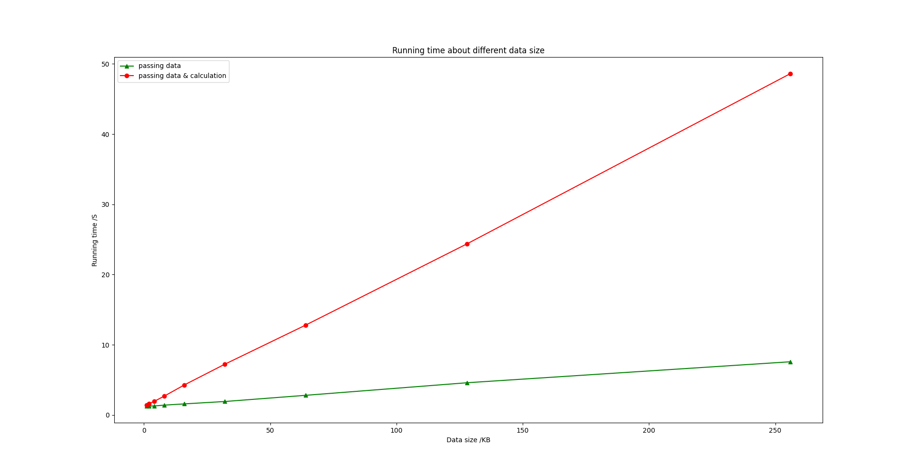
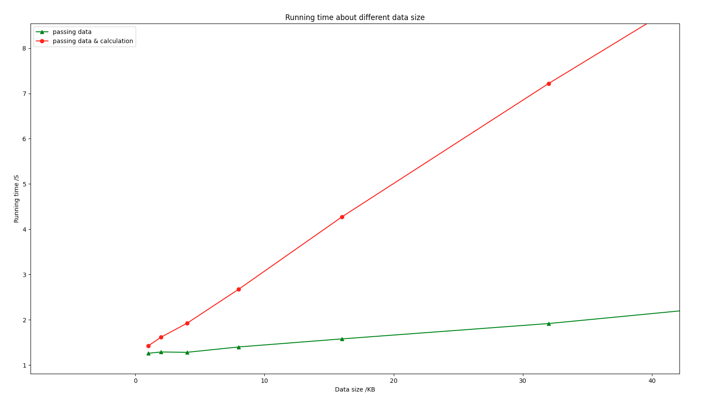
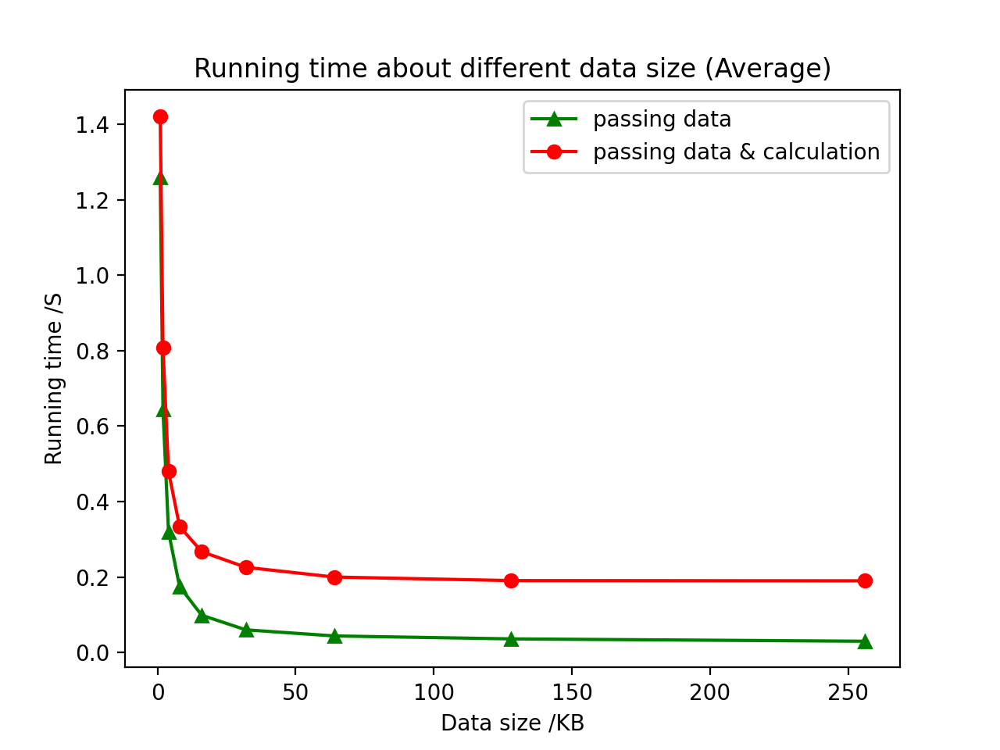
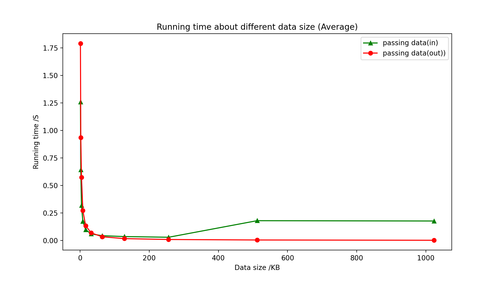

# OSORT

## 1. Overview

This repo is used for testing the execution time to pass different size of data inside an SGX (in), do some calculations, and copy it back outside.

## 2. Environment

- `. /opt/openenclave/share/openenclave/openenclaverc`
- `/opt/openenclave/bin/oegdb -arg ./host/osorthost ./enclave/osortenc.signed `

### 2.1 Hardware

- CPU:
  - Intel(R) Xeon(R) E-2288G CPU @ 3.70GHz
  - cache size: 16384 KB
- SGX:
  - Linux SGX 5.11.0-1025-azure

### 2.2 Software

- System:
  - Linux: Ubuntu 20.04.1
- SDK:
  - Open Encalve SDK

## 3. Building

```
$ make
  or
$ make build
```

## 4. Testcase

### 4.1 Passing data

We pass different size data from the host to the enclave using pointer, and return to the host. We record the time in the host for running 20000 passing data iterations.

### 4.2 Passing data and calculate

We pass different size data from the host to the enclave using pointer, add all the data and return to the host. We record the time in the host for running 20000 passing data iterations.

### 4.3 Results

data size = [1, 2, 4, 8, 16, 32, 64, 128, 256] KB

1. Execution time about different data size

- Overview

<center class="half">


</center>

- Details

2. Average execution time about different data size
<center>

</center>

3. Average execution time about different passing direction

<center>

</center>

4. Data

- [Passing Parameter Types](https://github.com/intel/linux-sgx/blob/master/SampleCode/SampleEnclave/Enclave/Edger8rSyntax/Pointers.edl)

| data size (KB) / running time (s) |  pass(in)  | pass(in) & calculate | pass(user_check) | pass & calculate(user_check) | pass(out) |
| :-------------------------------- | :--------: | :------------------: | :--------------: | :--------------------------: | :-------: |
| 1                                 |  1.258899  |       1.421846       |     1.127710     |           1.246155           | 1.789539  |
| 2                                 |  1.287418  |       1.616117       |     1.087917     |           1.414399           | 1.869617  |
| 4                                 |  1.280107  |       1.921882       |     1.103228     |           1.730354           | 2.299129  |
| 8                                 |  1.398573  |       2.673572       |     1.092850     |           2.430098           | 2.174802  |
| 16                                |  1.576942  |       4.274649       |     1.091328     |           3.590763           | 2.160760  |
| 32                                |  1.916218  |       7.221779       |     1.082583     |           6.155769           | 2.222035  |
| 64                                |  2.796984  |      12.790657       |     1.123476     |          11.032313           | 2.178012  |
| 128                               |  4.590082  |      24.379629       |     1.086970     |          21.522796           | 2.200557  |
| 256                               |  7.576735  |      48.610560       |     1.116413     |          41.829929           | 2.347312  |
| 512                               | 92.201309  |                      |                  |          80.780458           | 2.443506  |
| 1024                              | 181.488266 |                      |                  |          163.342863          | 2.355674  |
